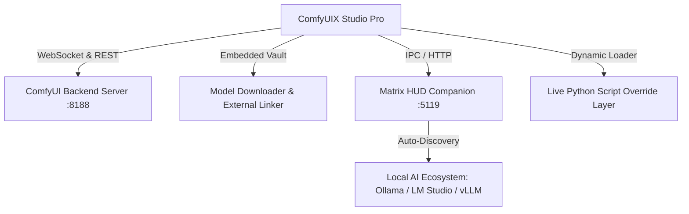

<div align="center">

# ⚡ ComfyUIX Studio Pro
### Native Windows 11 Desktop AI Creation Suite & Matrix HUD Companion

[](https://github.com)
[](https://python.org)
[](https://github.com)
[](LICENSE)
[-success?style=for-the-badge)](https://github.com)

<p align="center">
  <b>A blazing-fast, obsidian-glass native desktop application for ComfyUI workflows, local AI inference, and real-time GPU orchestration.</b>
</p>

[Key Features](#-key-features) • [Installation](#-installation) • [Architecture](#-architecture) • [Instant Live Updating](#-instant-live-updating) • [Matrix HUD Companion](#-matrix-hud-companion) • [Configuration](#-configuration)

---

</div>

## 🌟 Overview

**ComfyUIX Studio Pro** transforms your local AI workflow from a browser-bound interface into a high-performance, native Windows 11 desktop workstation. Engineered with a responsive **Obsidian Cyber Glass UI**, it orchestrates the ComfyUI backend in the background while providing an integrated **1-Click Model Vault**, live **VRAM telemetry**, full **slider delegation**, and **Matrix HUD companion auto-discovery**.

Whether generating SDXL masterpieces, upscaling high-resolution artwork, creating animations, or monitoring local LLMs, ComfyUIX delivers a seamless, zero-friction experience.

---

## ✨ Key Features

### 🎨 Obsidian Glass UI & Ergonomics
- **Zero-Void Geometry**: Docked 30px system status bar and zero vertical dead space.
- **True Scroll Delegation**: Parameter sliders (Model Strength, CLIP Strength, CFG) never intercept scroll events when navigating down the page.
- **Matrix Cyber Scrollbars**: Slim 6px auto-hiding scrollbars with glowing hover accents.
- **0% Idle CPU Load**: Ultra-optimized acrylic backdrop rendering with debounced redraws.
- **Universal Floating Scaling**: Multi-tier typography and widget scaling (`80%`, `90%`, `100%`, `110%`, `120%`, `125%`, `150%`).

### 🧠 1-Click Model Vault & External Linker
- **In-App Model Vault**: Embedded directly in Settings for 1-click downloading of curated SDXL, SD 1.5, and Upscalers with resume support.
- **External Folder Linking**: Instantly link your existing Automatic1111, Forge, or ComfyUI checkpoint directories without re-downloading gigabytes of model weights.
- **Auto-Scan on Launch**: Discovers local and linked safetensors on startup and after downloads.

### ⚡ Instant Hot-Patch & Live Updating
- **No 273MB Rebuilds Needed**: Dynamic script override layer automatically loads updated Python modules directly in memory.
- **0.05s Live Sync**: Sync codebase changes across all application folders instantly using `quick_update.bat`.
- **In-Memory UI Hot-Reload**: Rebuild the UI on-the-fly (`⚡ Hot Reload UI`) without interrupting active backend tasks.

### 🤖 Matrix HUD Companion App
- **Live Hardware Telemetry**: Real-time VRAM, GPU utilization, RAM, CPU, and token generation speed (tok/s) graphs.
- **Multi-Server Auto-Discovery**: Automatically discovers and pings running local AI backends:
  - `ComfyUI` (`http://127.0.0.1:8188`)
  - `Hermes Proxy` (`http://127.0.0.1:5119`)
  - `Ollama` (`http://127.0.0.1:11434`)
  - `LM Studio` (`http://127.0.0.1:1234`)
  - `vLLM / LocalAI` (`http://127.0.0.1:8000`)
  - `Text-Gen WebUI` (`http://127.0.0.1:7860`)
- **Matrix Rain Background**: Smooth 30ms time-based digital rain with click-to-pause.

---

## 🏗️ Architecture



---

## 🚀 Installation & Quickstart

### Option 1: Standalone Windows Installer (Recommended)
1. Download the latest `ComfyUIX_Setup.exe` from [Releases](https://github.com).
2. Run the installer. It will automatically set up the desktop shortcut and configure paths.
3. Launch **ComfyUIX** from your Desktop or Start Menu.

### Option 2: Run from Source
Ensure you have **Python 3.11** installed on Windows.

```powershell
# 1. Clone the repository
git clone https://github.com/Bonbrake/ComfyUIX.git
cd ComfyUIX

# 2. Install dependencies
pip install -r requirements.txt

# 3. Launch Development Mode
python main.py
```

---

## ⚡ Instant Live Updating Workflow

For rapid development and customizing features:

```powershell
# 1. Edit any source file (ComfyUI_App.py, glass.py, hermes_app.py, etc.)
# 2. Run instant sync (Takes < 0.1s!)
python quick_update.py

# 3. Relaunch or hit '⚡ Hot Reload UI' in Settings — Your changes are live instantly!
```

---

## ⚙️ Configuration & Custom Paths

Access **⚙ APPLICATION SETTINGS & CONFIGURATION** to customize:

| Setting | Description |
| :--- | :--- |
| **Output Directory** | Target folder for all generated images (`📁 Browse` and `⚡ Open Folder`). |
| **Input Directory** | Folder for source images used in Img2Img and Inpainting. |
| **External Models Path** | Custom directory linking existing A1111/Forge model checkpoints. |
| **Backend Python** | Path to custom Python executable for the embedded ComfyUI server. |
| **ComfyUI Server URL** | Configurable host address (defaults to `http://127.0.0.1:8188`). |
| **Factory Reset** | One-click button to restore clean default settings. |

---

## ⌨️ Keyboard Shortcuts

| Shortcut | Action |
| :--- | :--- |
| `Ctrl + E` | Trigger Generation / Queue Prompt |
| `Ctrl + O` | Open Output Gallery Directory |
| `Ctrl + R` | Restart ComfyUI Backend Server |
| `Ctrl + Shift + R` | In-Memory UI Hot-Reload |
| `F1` | Toggle Interactive Tooltips |
| `F5` | Refresh Model Catalog & Thumbnails |

---

## 🛠️ Tech Stack

- **Core Frontend**: Python 3.11, [CustomTkinter](https://github.com/TomSchimansky/CustomTkinter), Tkinter Canvas, Pillow (PIL)
- **Companion HUD**: PySide6 (Qt 6), QPainter Vector Graphics, QThread Telemetry Workers
- **Backend Communication**: WebSockets (`ws_client.py`), HTTP REST (`requests`, `urllib`)
- **Packaging & Deployment**: PyInstaller 6.x (Bundled Windows Executable), Inno Setup 6 (Installer)

---

## 📄 License

This project is licensed under the **MIT License** — see the [LICENSE](LICENSE) file for details.

---

<div align="center">
  <sub>Crafted with precision for local AI creators. Powered by ComfyUI.</sub>
</div>
